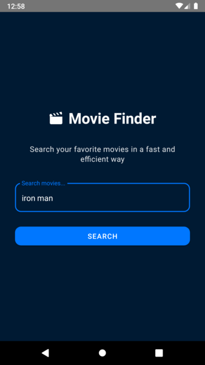
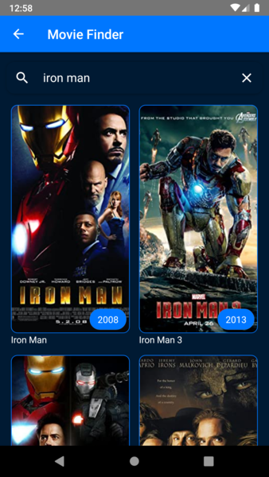
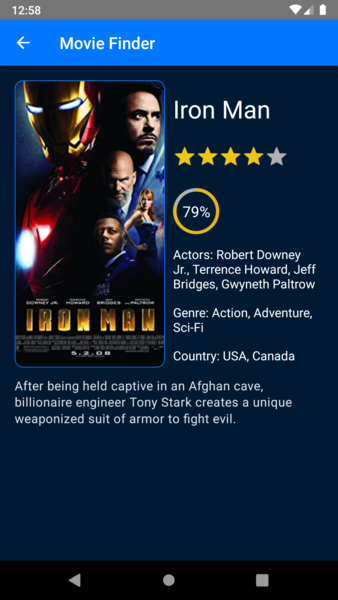

<h1 align="center">
  <a href="/">
    Movie Finder
  </a>
</h1>

  <strong>Search your favorite movies in a fast and efficient way</strong> 

## Download

- You can download the app for android here
https://drive.google.com/file/d/18KVRXF25jR91_aU9Gp1V5-C_lDWrpLQW/view?usp=sharing

## Captures

  

  

  

## Step by step

- Environtment setup: 
 
https://reactnative.dev/docs/environment-setup
- Clone the repository: 
 
`git clone https://github.com/AlexisFabianCarranza/React-Native-Movie-Finder.git`
- Install dependencies: 
 
`yarn`
- Run project: 
`npm run android`
`npm run ios`

## Information

- This app use the api http://www.omdbapi.com/

## Main dependencies
- React native paper | https://callstack.github.io/react-native-paper/
- React navigation | https://reactnavigation.org/
